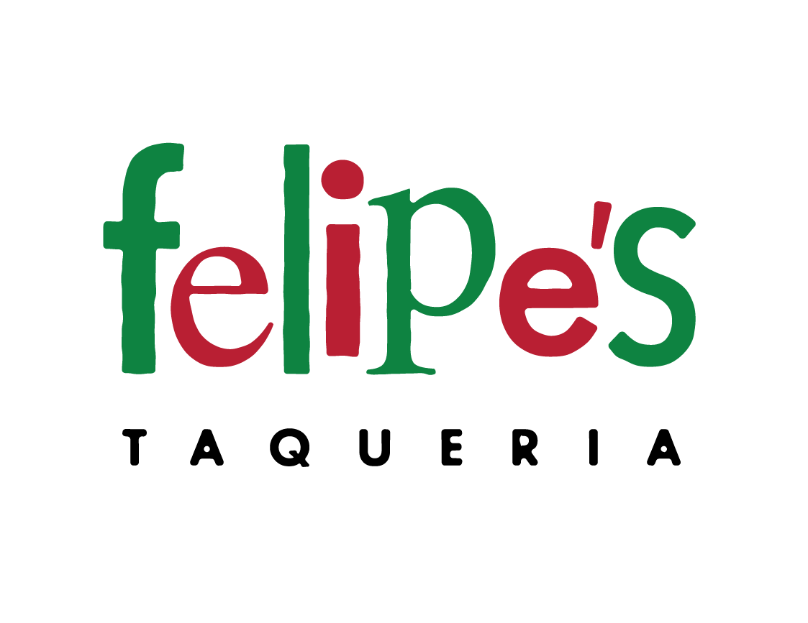

# Felipe’s Taqueria

Uno de los lugares más populares para comer en Harvard Square es Felipe’s Taqueria, que ofrece un menú de platos principales, según el siguiente diccionario, donde el valor de cada clave es un precio en dólares:



```python
{
    "Baja Taco": 4.25,
    "Burrito": 7.50,
    "Bowl": 8.50,
    "Nachos": 11.00,
    "Quesadilla": 8.50,
    "Super Burrito": 8.50,
    "Super Quesadilla": 9.50,
    "Taco": 3.00,
    "Tortilla Salad": 8.00
}
```

En un archivo llamado taqueria.py, implementa un programa que permita a un usuario hacer un pedido, solicitándole los artículos, uno por línea, hasta que el usuario ingrese control-d (que es una forma común de terminar la entrada a un programa). Después de cada artículo ingresado, muestra el costo total de todos los artículos ingresados hasta el momento, precedido por un signo de dólar ($) y formateado a dos decimales. Trata la entrada del usuario sin importar mayúsculas o minúsculas. Ignora cualquier entrada que no sea un artículo. Supón que cada artículo del menú estará en mayúsculas iniciales.

### Pistas

Ten en cuenta que puedes detectar cuando el usuario ha ingresado control-d capturando un EOFError con un código como:

```python
try:
    item = input()
except EOFError:
    ...
```

Podrías querer imprimir una nueva línea para que el cursor del usuario (y la solicitud subsiguiente) no permanezca en la misma línea que la solicitud de tu programa.

Ingresar control-d no requiere presionar Enter también, por lo que el cursor del usuario (y la solicitud subsiguiente) podría permanecer en la misma línea que la solicitud de tu programa. ¡Puedes mover el cursor del usuario a una nueva línea imprimiendo \n tú mismo!

Ten en cuenta que un diccionario (dict) tiene bastantes métodos, según docs.python.org/3/library/stdtypes.html#mapping-types-dict, entre ellos `get`, y admite operaciones como:

```python
d[key]
```

y

```python
if key in d:
    ...
```

donde d es un diccionario y key es una cadena (str).

Asegúrate de evitar o capturar cualquier KeyError.

## Antes de Comenzar

Inicia sesión en cs50.dev, haz clic en tu ventana de terminal y ejecuta `cd` por sí solo. Deberías ver que el indicador de la ventana de tu terminal se asemeja a lo siguiente:

```bash
$
```

Luego ejecuta

```bash
mkdir taqueria
```

para crear una carpeta llamada taqueria en tu espacio de código.

Luego ejecuta

```bash
cd taqueria
```

para cambiar de directorio a esa carpeta. Ahora deberías ver el indicador de tu terminal como taqueria/ $. Ahora puedes ejecutar

```bash
code taqueria.py
```

para crear un archivo llamado taqueria.py donde escribirás tu programa.

## Cómo Probar

Así es como puedes probar tu código manualmente:

Ejecuta tu programa con

```bash
python taqueria.py
```

Escribe Taco y presiona Enter, luego escribe Taco nuevamente y presiona Enter. Tu programa debería mostrar:

```bash
Total: $6.00
```

y continuar solicitando al usuario hasta que ingrese control-d.

Ejecuta tu programa con

```bash
python taqueria.py
```

Escribe Baja Taco y presiona Enter, luego escribe Tortilla Salad y presiona Enter. Tu programa debería mostrar:

```bash
Total: $12.25
```

y continuar solicitando al usuario hasta que ingrese control-d.

Ejecuta tu programa con

```bash
python taqueria.py
```

Escribe Burger y presiona Enter. Tu programa debería volver a solicitar al usuario.

Asegúrate de probar otros alimentos y variar el uso de mayúsculas y minúsculas en tu entrada. Tu programa debería comportarse como se espera, sin importar mayúsculas o minúsculas.

Puedes ejecutar lo siguiente para verificar tu código usando check50, un programa que CS50 usará para probar tu código cuando lo envíes. ¡Pero asegúrate de probarlo tú mismo también!

```bash
check50 cs50/problems/2022/python/taqueria
```

Las caritas verdes significan que tu programa ha pasado una prueba. Las caritas rojas indicarán que tu programa mostró algo inesperado. Visita la URL que check50 te proporciona para ver la entrada que check50 entregó a tu programa, qué salida esperaba y qué salida dio tu programa realmente.

Cómo Enviar
En tu terminal, ejecuta lo siguiente para enviar tu trabajo.

```bash
submit50 cs50/problems/2022/python/taqueria
```
