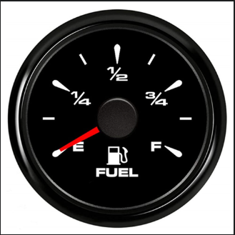

# Fuel Gauge

## fuel gauge

Fuente: amazon.com/dp/B09C4FL56G


Los indicadores de combustible indican, a menudo con fracciones, cuánto combustible hay en un tanque. Por ejemplo, 1/4 indica que un tanque está lleno al 25%, 1/2 indica que un tanque está lleno al 50%, y 3/4 indica que un tanque está lleno al 75%.

En un archivo llamado fuel.py, implementa un programa que solicite al usuario una fracción, formateada como X/Y, donde cada uno de X y Y es un número entero, y luego muestra, como un porcentaje redondeado al número entero más cercano, cuánta gasolina hay en el tanque. Sin embargo, si queda 1% o menos, muestra E en su lugar para indicar que el tanque está esencialmente vacío. Y si queda 99% o más, muestra F en su lugar para indicar que el tanque está esencialmente lleno.

Si X o Y no es un número entero, X es mayor que Y, o Y es 0, solicita al usuario nuevamente. (No es necesario que Y sea 4.) Asegúrate de capturar cualquier excepción como ValueError o ZeroDivisionError.

## Pistas

Recuerda que una cadena (str) tiene bastantes métodos, según docs.python.org/3/library/stdtypes.html#string-methods, incluyendo split.
Ten en cuenta que puedes manejar dos excepciones por separado con un código como:

```python
try:
    ...
except ValueError:
    ...
except ZeroDivisionError:
    ...
```

O puedes manejar dos excepciones juntas con un código como:

```python
try:
    ...
except (ValueError, ZeroDivisionError):
    ...
```

## Antes de Comenzar

Inicia sesión en cs50.dev, haz clic en tu ventana de terminal y ejecuta `cd` por sí solo. Deberías ver que el indicador de la ventana de tu terminal se asemeja a lo siguiente:

```bash
$
```

Luego ejecuta

```bash
mkdir fuel
```

para crear una carpeta llamada fuel en tu espacio de código.

Luego ejecuta

```bash
cd fuel
```

para cambiar de directorio a esa carpeta. Ahora deberías ver el indicador de tu terminal como fuel/ $. Ahora puedes ejecutar

```bash
code fuel.py
```

para crear un archivo llamado fuel.py donde escribirás tu programa.

Cómo Probar
Así es como puedes probar tu código manualmente:

Ejecuta tu programa con

```bash
python fuel.py
```

Escribe 3/4 y presiona Enter. Tu programa debería mostrar:

```bash
75%
```

Ejecuta tu programa con

```bash
python fuel.py
```

Escribe 1/4 y presiona Enter. Tu programa debería mostrar:

```bash
25%
```

Ejecuta tu programa con

```bash
python fuel.py
```

Escribe 4/4 y presiona Enter. Tu programa debería mostrar:

```bash
F
```

Ejecuta tu programa con

```bash
python fuel.py
```

Escribe 0/4 y presiona Enter. Tu programa debería mostrar:

```bash
E
```

Ejecuta tu programa con

```bash
python fuel.py
```

Escribe 4/0 y presiona Enter. Tu programa debería manejar un ZeroDivisionError y solicitar al usuario nuevamente.

Ejecuta tu programa con

```bash
python fuel.py
```

Escribe three/four y presiona Enter. Tu programa debería manejar un ValueError y solicitar al usuario nuevamente.

Ejecuta tu programa con

```bash
python fuel.py
```

Escribe 1.5/3 y presiona Enter. Tu programa debería manejar un ValueError y solicitar al usuario nuevamente.

Ejecuta tu programa con

```bash
python fuel.py
```

Escribe 5/4 y presiona Enter. Tu programa debería solicitar al usuario nuevamente.

Puedes ejecutar lo siguiente para verificar tu código usando check50, un programa que CS50 usará para probar tu código cuando lo envíes. ¡Pero asegúrate de probarlo tú mismo también!

```bash
check50 cs50/problems/2022/python/fuel
```

Las caritas verdes significan que tu programa ha pasado una prueba. Las caritas rojas indicarán que tu programa mostró algo inesperado. Visita la URL que check50 te proporciona para ver la entrada que check50 entregó a tu programa, qué salida esperaba y qué salida dio tu programa realmente.

## Cómo Enviar

En tu terminal, ejecuta lo siguiente para enviar tu trabajo.

```bash
submit50 cs50/problems/2022/python/fuel
```
